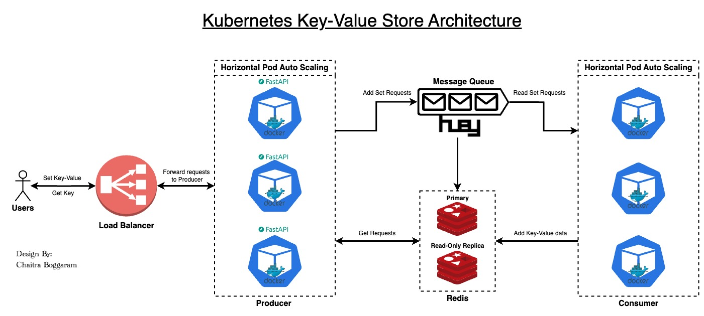

# K8S-Key-Value-Store

A Key-Value store has been developed using Kubernetes (K8s) with Minikube for clustering. Docker Containers are employed as containers within Minikube pods. The FastAPI web framework is utilized for building APIs, while Huey serves as a REDIS queue and storage solution with replication and autoscaling features.


## Table of Contents

1. [Kubernetes Key-Value Store Architecture](#kubernetes-key-value-store-architecture)
  
2. [Pre-requisites](#pre-requisites)
   - [Install Homebrew](#1-install-homebrew)
   - [Install Docker](#2-install-docker)
   - [Install MiniKube](#3-install-minikube)
  
3. [How to Start the K8S-Key-Value Service](#how-to-start-the-k8s-key-value-service)
   - [Start Minikube](#1-start-minikube)
   - [Run the Makefile](#2-run-the-makefile)
   - [Post Key-Value Pair to Redis](#3-post-key-value-pair-to-redis)
   - [Get Keys for Specific Key](#4-get-keys-for-specific-key)
   - [Clean Installation](#5-clean-installation)
   - [Stop Minikube](#6-stop-minikube)
  
4. [Kubernetes Gotchas](#kubernetes-gotchas)
   - [Check Pods or Services or Deployments Status](#1-check-pods-or-services-or-deployments-status)
   - [Start Minikube Tunnel](#2-start-minikube-tunnel)
   - [Enable Minikube Metrics](#3-enable-minikube-metrics)
  
5. [Load Testing](#load-testing)
   - [Test Load without Any Key Pair](#1-if-you-want-to-test-load-without-any-key-pair)
   - [Load Test on an Existing Key](#2-if-you-want-to-load-test-on-an-existing-key)

6. [Additional References](#additional-references)
   - [Detailed Explanation.md](Detailed%20Explanation.md)


</br>

---

### Kubernetes Key-Value Store Architecture



</br>

---

### Pre-requisites 

NOTE: The instructions below are based on MacOS.


1. **Install Homebrew:**

    ```bash
    /bin/bash -c "$(curl -fsSL https://raw.githubusercontent.com/Homebrew/install/HEAD/install.sh)"
    ```

2. **Install Docker:**

    - Download Docker from [Docker Documentation](https://docs.docker.com/) based on your Operating System. Sign up with your email address.
    - Check Docker version:

        ```bash
        docker --version
        ```

3. **Install MiniKube:**

    ```bash
    brew install minikube
    ```

</br>

---


### How to Start the K8S-Key-Value Service

1. **Start Minikube:**

    ```bash
    minikube start
    ```
If this does not start up or throw error especially for Apple Silicon Chip Macbooks, run `minikube start --driver=docker`

2. **Run the Makefile:**

    ```bash
    make
    ```
- `make create`: By default, make command runs make create. This creates and sets up the whole kubernetes project
- `make deploy`: If you want to update any kubernetes infrastructure

3. **Test Key-Value Store service**
    ```bash
    make test
    ```

4. **Post Key-Value Pair:**

    ```bash
    curl -X POST http://localhost:8000/set/Key/Value
    ```

5. **Get Keys for Specific Key:**

    ```bash
    curl http://localhost:8000/get/Key
    ```

6. **Clean Installation:**

    ```bash
    make clean 
    ```

7. **Stop Minikube:**

    ```bash
    minikube stop
    ```
</br>

---

### Kubernetes gotchas

1. **Check Pods or services or deployments status**

    ```bash
    kubectl get pods
    kubectl get services
    kubectl get deployments
    ```

    Use `-o wide` to get more details about pods and services. For example, `kubectl get pods -o wide`.

2. **Start Minikube Tunnel**

    ```bash
    minikube tunnel
    ```
    Minikube tunnel creates a secure tunnel to the minikube node, allowing external traffic to reach the node port and the service. In our example this gives external IP address for the loadbalancer i.e `127.0.0.1` or `localhost`. To test if the webserver is running access http://localhost:8000 on your browser.

3. **Enable minikube metrics**
    ```bash
    minikube addons enable metrics-server
    ```
    This is optional to check for autoscaling metrics. Wait for 2 mins and then type `kubectl get hpa` to check the metrics

</br>

---

### Load Testing


1. **If you want to test load without any key pair**
```bash
kubectl run -i --tty load-generator --rm --image=busybox:1.28 --restart=Never -- /bin/sh -c "while sleep 0.01; do wget -q -O- http://loadbalancer-service:8000/; done"
```

2. **If you want to load test on an existing key**
```bash
kubectl run -i --tty load-generator --rm --image=busybox:1.28 --restart=Never -- /bin/sh -c "while sleep 0.01; do wget -q -O- http://loadbalancer-service:8000/get/Key1; done"
```
Wait for 2 mins to view the changes, you can run `kubectl get hpa` to check the metrics updates or run `kubectl get pods` number of pods that are running currently
### In case of any issues or for additional commands, refer to [Detailed Explanation.md](Detailed%20Explanation.md).